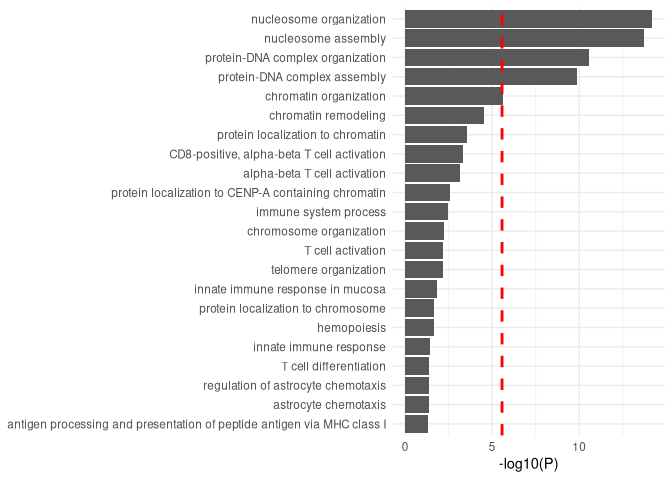

# Host control of persistent Epstein–Barr virus infection

## Part 1: Paper Summary

The paper investigates the biological basis of host control of
persistent Epstein-Barr virus (EBV) infection. EBVread was used to
detect increased viral load in blood cells which was associated with HIV
infection, immunosuppressive drug intake, and smoking status. They used
blood-based genome sequence data from UK BioBank (486,315) and All of Us
(336,123) participants and found short read-pairs mapping to EBV genome
in 38% of the total samples. GWAS of EBVread showed strong association
with the major histocompatibility complex, 54 independent human
leukocyte antigen alleles of MHC class I and II. They also found
epistasis, when a gene inhibits/modifies the expression of a non-allelic
gene, in the ERAP2 locus. Individuals with multiple sclerosis had a
higher polygenic burden of EBVread for MHC class I HLA alleles and same
burden increase was seen in individuals with rheumatoid arthritis at MHC
class II. The also conducted a PheWAS which found that a polygenic
overlap of EBVread with inflammatory bowel disease, hypothyrodism, and
type 1 diabetes.

## Part 2: Rationale, Methods, and Results

They conducted analysis on UK biobank and All of Us data separately to
collect high quality SNPs and gene association and then combined them
for further analysis with GWAS, fine-mapping, gene-gene interaction,
enrichment analysis, and PheWAS.

#### 1. GWAS

After identifying common variants in the cohort and HLA alleles the
conducted GWAS on the EBV reads. Variant inclusion criteria was MAC
&gt;= 25 (predicted). GWAS was used to discover loci/variants associated
with immune response variation. They compared the GWAS data for memory B
cell abundance and human herpesvirus 7 (HHV7). GWAS relies on proper QC
of population structures and phenotype measurement, which if violated
weaken the association we see. Looking at the QC process I don’t think
these were violated. They did find variants in the MHC region and other
HLA loci, which points towards immune pathways being associated. Their
Manhatten plot had numerous strong associations and they had a large
sample size but casual interpretation is limited in GWAS studies because
it could also be indicative by linkage disequilibrium.

#### 2. Fine-mapping

Fine mapping refines the GWAS signals, allowing them to better interpret
the loci in the MHC region and HLA alleles. This step relies on
imputation accuracy which they also pointed out as a challenge in these
specific, possible that some association were missed or caused by
linkage disequilibrium. They did exclude individuals that lacked
imputation data in the QC and association steps. Cis-eQTL identified 18
variant-gene-cell-type association, mostly for ERAP2

#### 3. MAGMA

MAGMA integrates gene-based p-values into a gene set testing framework
which tests whether genes in a set are more strongly associated with the
phenotype. The authors used it to see if a specific biological pathway
or gene set is statistically significant. They found that IEI genes were
significant. This I think is in line with their goal, which was to see
if immune cell pathways are significant in EBV persistence. The only
thing I could think of as skew or violating the claim would be if the
SNP were not accurately coded to the gene sets which could make the IEI
genes a bit less significant but not completely take away the results
from previous analysis, maybe make other immune pathways more
significant.

#### 5. PheWAS

PheWAS introduces reverse genetics approach to see if the genes/
variants we found are associated with multiple phenotypes. Apart from
Sjorgren disease, all PheCodes were EBV-associated diseases. Which is
what the authors were looking for to make sure the genes are not
associated with another disease which they would have to look into with
further analysis. This step heavily relies on the phenocodes are encoded
properly in health records. Misclassification could cause random disease
or even important ones to be left out of the results, making the
reliability questionable. The results for this is definitely more
suggestive and associatitive than casual since the EHR phenocodes are
not easiest to ensure accuracy on I would say.

## Part 3: Vibe-Replication (Code + Explanation)

### Load Packages

    library(readxl)
    library(AnnotationDbi)

    ## Loading required package: stats4

    ## Loading required package: BiocGenerics

    ## Loading required package: generics

    ## 
    ## Attaching package: 'generics'

    ## The following objects are masked from 'package:base':
    ## 
    ##     as.difftime, as.factor, as.ordered, intersect, is.element, setdiff,
    ##     setequal, union

    ## 
    ## Attaching package: 'BiocGenerics'

    ## The following objects are masked from 'package:stats':
    ## 
    ##     IQR, mad, sd, var, xtabs

    ## The following objects are masked from 'package:base':
    ## 
    ##     anyDuplicated, aperm, append, as.data.frame, basename, cbind,
    ##     colnames, dirname, do.call, duplicated, eval, evalq, Filter, Find,
    ##     get, grep, grepl, is.unsorted, lapply, Map, mapply, match, mget,
    ##     order, paste, pmax, pmax.int, pmin, pmin.int, Position, rank,
    ##     rbind, Reduce, rownames, sapply, saveRDS, table, tapply, unique,
    ##     unsplit, which.max, which.min

    ## Loading required package: Biobase

    ## Welcome to Bioconductor
    ## 
    ##     Vignettes contain introductory material; view with
    ##     'browseVignettes()'. To cite Bioconductor, see
    ##     'citation("Biobase")', and for packages 'citation("pkgname")'.

    ## Loading required package: IRanges

    ## Loading required package: S4Vectors

    ## 
    ## Attaching package: 'S4Vectors'

    ## The following object is masked from 'package:utils':
    ## 
    ##     findMatches

    ## The following objects are masked from 'package:base':
    ## 
    ##     expand.grid, I, unname

    library(org.Hs.eg.db)

    ## 

    library(gprofiler2)
    library(tidyverse)

    ## ── Attaching core tidyverse packages ──────────────────────── tidyverse 2.0.0 ──
    ## ✔ dplyr     1.1.4     ✔ readr     2.1.5
    ## ✔ forcats   1.0.0     ✔ stringr   1.5.1
    ## ✔ ggplot2   4.0.1     ✔ tibble    3.3.0
    ## ✔ lubridate 1.9.4     ✔ tidyr     1.3.1
    ## ✔ purrr     1.1.0

    ## ── Conflicts ────────────────────────────────────────── tidyverse_conflicts() ──
    ## ✖ lubridate::%within%() masks IRanges::%within%()
    ## ✖ dplyr::collapse()     masks IRanges::collapse()
    ## ✖ dplyr::combine()      masks Biobase::combine(), BiocGenerics::combine()
    ## ✖ dplyr::desc()         masks IRanges::desc()
    ## ✖ tidyr::expand()       masks S4Vectors::expand()
    ## ✖ dplyr::filter()       masks stats::filter()
    ## ✖ dplyr::first()        masks S4Vectors::first()
    ## ✖ dplyr::lag()          masks stats::lag()
    ## ✖ ggplot2::Position()   masks BiocGenerics::Position(), base::Position()
    ## ✖ purrr::reduce()       masks IRanges::reduce()
    ## ✖ dplyr::rename()       masks S4Vectors::rename()
    ## ✖ lubridate::second()   masks S4Vectors::second()
    ## ✖ lubridate::second<-() masks S4Vectors::second<-()
    ## ✖ dplyr::select()       masks AnnotationDbi::select()
    ## ✖ dplyr::slice()        masks IRanges::slice()
    ## ℹ Use the conflicted package (<http://conflicted.r-lib.org/>) to force all conflicts to become errors

### Attempted Reproduction

We will be attempting to reproduce the gene-set analysis using
[MAGMA](https://cncr.nl/research/magma/) from the “Gene-based analyses
suggest an enrichment of IEI genes” portion of the paper. The following
steps with code are provided and exact links are contained with the
scripts of this repository and may be fetched with the `get_data.sh`
script

In regards to simplifications and assumptions, this came down to gene
IDs. We could not guarantee the same version of the IEI gene list or the
GRCh37 genes. We could have attempted to merge these on a common ID
reference like ENTREZ, but this seemed like a time-consuming complexity
beyond the need of this assignment. Overall, though, we were generally
able to reproduce this MAGMA analysis pipeline. We will discuss
discrepencies between our results and theirs in a following section. We
ran two tests with MAGAM, one for the IEI gene set list and one for 14
genes that cause monogenic EBV-driven lymphoproliferative diseases.

We also continued on from these results to generate a figure of GO
Biological Process annotations. While the paper did not specify how they
did these, we will proceed with the GO annotations using `gprofiler2`
and `ggplot`.

#### 1. Load the data and MAGMA binary

We need to load: - The magma standalone binary (since this isn’t loaded
on the cluster) - The GWAS summary data from Locus Zoom - The European
LD data - The Gene location file for GRCh37 - The IEI gene set

NOTE: there is a chance that the gene IDs from the IEI gene set and
GRCh37 have diverged over time or require mapping. For the sake of this
project, we have decided to assume they match closely and will not try
to manually ensure all of these map appropriately. We are just going to
mark this up to issue with reproducibility and how versioning is a
nightmare in gene naming/identification.

    if [ -d data ]; then
        echo "Directory exists, deleting now..."
        rm -rf data
    fi
    if [ -d magma ]; then
        echo "Directory exists, deleting now..."
        rm -rf magma
    fi
    ./get_data.sh

#### 2. Cleanup the GWAS Summary Data from LocusZoom

We need to split the LocusZoom summary data into two files for input
into MAGMA: - a SNP location file for the annotation step - a SNP
P-value file for the Gene-level analysis - also are removing the HMC
region as they do in the paper

    # load the summary data from LocusZoom
    lz_stats = read_table("data/summary_stats")

    # clean the names
    lz_stats = lz_stats %>% 
      rename(
        SNP = rsid,
        CHR = `#chrom`,
        BP = pos
      ) %>% 
      mutate( # we have -log10 p-value, need unadjusted
        P = 10^(-neg_log_pvalue)
      )

    # filter our the Major Histocompatibility Complex (HMC) region
    # chr6:28,510,120–33,480,577
    # https://www.sciencedirect.com/science/article/pii/S1357272520301990
    lz_stats = lz_stats %>% 
      filter(
        !(CHR == 6 & BP >= 28510120 & BP <= 33480577)
      )

    # create the file for annotation
    write.table(
      lz_stats %>% select(SNP, CHR, BP),
      file = "data/snp.loc",
      sep = "\t",
      row.names = FALSE,
      quote = FALSE
    )

    # create the file for analysis
    write.table(
      lz_stats %>% select(SNP, P),
      file = "data/gwas.txt",
      sep = "\t",
      row.names = FALSE,
      quote = FALSE
    )

#### 3. Prepare the IEI Gene Set File

    gene_table = read_xlsx("data/IEI.xlsx")

    ## New names:
    ## • `HPO` -> `HPO...18`
    ## • `HPO` -> `HPO...19`

    # ignoring any genes with duplicate IDs or other text

    gene_table$Gene = gene_table$`Genetic defect`

    iei_genes = gene_table %>% 
      filter(
        !str_detect(Gene, "\\s")
      )

    iei_genes = unique(trimws(iei_genes$Gene))

    # convert these to entrez IDs
    iei_genes <- mapIds(
      org.Hs.eg.db, 
      keys = iei_genes, 
      column = "ENTREZID", 
      keytype = "SYMBOL", 
      multiVals = "first"
    )

    ## 'select()' returned 1:1 mapping between keys and columns

    # remove any NAs (failed to map to ENTREZ ID)
    iei_genes = iei_genes[!is.na(iei_genes)]

    iei_genes = c(
      "IEI",
      iei_genes
    )

    # the set of "14 genes that cause monogenic EBV-driven lymphoproliferative diseases"
    # cited from this paper: https://link.springer.com/article/10.1007/s00439-020-02145-3
    # the paper was not too clear, so I had Claude generate this list and checked it
    lymph_genes = c(
      "SH2D1A",
      "XIAP",
      "ITK",
      "MAGT1",
      "CD27",
      "CD70",
      "CTPS1",
      "CORO1A",
      "RASGRP1",
      "TNFRSF9",
      "STK4",
      "CARMIL2",
      "DOCK8",
      "PRKCD"
    )

    # convert these to entrez IDs
    lymph_genes <- mapIds(
      org.Hs.eg.db, 
      keys = lymph_genes, 
      column = "ENTREZID", 
      keytype = "SYMBOL", 
      multiVals = "first"
    )

    ## 'select()' returned 1:1 mapping between keys and columns

    # remove any NAs (failed to map to ENTREZ ID)
    lymph_genes = lymph_genes[!is.na(lymph_genes)]

    lymph_genes = c(
      "Lymph_Disease",
      lymph_genes
    )

    # print these out to a file
    cat(
      iei_genes,
      file = "data/IEI_geneset.txt",
      sep = "\t"
    )
    cat(
      "\n",
      file = "data/IEI_geneset.txt",
      sep = "",
      append = TRUE
    )
    cat(
      lymph_genes,
      file = "data/IEI_geneset.txt",
      sep = "\t",
      append = TRUE
    )

#### 4. Run the MAGMA Pipeline

1.  Run SNP to Gene Annotation with MAGMA
2.  Run Gene-level Analysis with MAGMA
3.  Run the Gene Set Enrichment with MAGMA

<!-- -->

    ./run_magma.sh

#### 5. Overview of the Results with a Figure

Recreation of “Fig. 3: Characterization of non-MHC risk loci associated
with EBVread+.” Section “b”:

    # load the genes from IEI
    magma_genes = read.table(
      "data/ebv_gwas.genes.out",
      header=TRUE
    )

    # Number of genes tested
    n_genes <- nrow(magma_genes)
    n_genes

    ## [1] 18167

    # Bonferroni threshold
    bonferroni_threshold = 0.05 / n_genes
    bonferroni_threshold

    ## [1] 2.752243e-06

    # Add corrected p-value column
    magma_genes$p_bonferroni = p.adjust(magma_genes$P, method = "bonferroni")

    # Significant genes
    sig_genes = magma_genes[magma_genes$p_bonferroni < 0.05, ]
    sig_genes = sig_genes$GENE

    results <- gost(
      query = sig_genes,
      organism = "hsapiens",
      sources = "GO:BP",
      correction_method = "bonferroni",
      evcodes = TRUE,
      numeric_ns = "ENTREZGENE_ACC"   # tells g:Profiler these are Entrez IDs
    )

    # get the top 30, same number displayed as the paper
    res_df = results$result[order(results$result$p_value),
                              c("term_name", "p_value", "term_size",
                                "intersection_size", "intersection")]

    top_30 = head(res_df, 30) %>% 
      mutate(
        `-log10(P)` = -log10(p_value)
      ) %>% 
      arrange(
        `-log10(P)`
      )
    nrow(top_30)

    ## [1] 22

    # generate the plot from the paper
    top_30 %>% 
      ggplot() +
      aes(
        x = `-log10(P)`,
        y = reorder(term_name, `-log10(P)`)
      ) +
      geom_col() +
      geom_vline(
        xintercept = -log10(bonferroni_threshold),
        color = "red",
        linetype = "dashed",
        size = 1
      ) +
      theme_minimal() +
      theme(axis.title.y = element_blank())

    ## Warning: Using `size` aesthetic for lines was deprecated in ggplot2 3.4.0.
    ## ℹ Please use `linewidth` instead.
    ## This warning is displayed once every 8 hours.
    ## Call `lifecycle::last_lifecycle_warnings()` to see where this warning was
    ## generated.

    # check which are below our bonferroni threshold
    top_30_sig = top_30 %>% 
      filter(
        `-log10(P)` > -log10(bonferroni_threshold)
      )
    nrow(top_30_sig)

    ## [1] 5

    top_30_sig

    ##                          term_name      p_value term_size intersection_size
    ## 1           chromatin organization 2.573310e-06      1216                24
    ## 2     protein-DNA complex assembly 1.410527e-10       213                15
    ## 3 protein-DNA complex organization 2.865698e-11       233                16
    ## 4              nucleosome assembly 1.870133e-14       118                15
    ## 5          nucleosome organization 6.409325e-15       138                16
    ##                                                                                                                    intersection
    ## 1 54665,26191,8320,29072,3024,8350,3006,8351,3013,8343,8367,8339,8353,3007,8361,8365,10473,8970,8341,8332,8354,8348,11339,23168
    ## 2                                                    3024,8350,3006,8351,8343,8367,8339,8353,3007,8361,8365,8970,8341,8354,8348
    ## 3                                              29072,3024,8350,3006,8351,8343,8367,8339,8353,3007,8361,8365,8970,8341,8354,8348
    ## 4                                                    3024,8350,3006,8351,8343,8367,8339,8353,3007,8361,8365,8970,8341,8354,8348
    ## 5                                              29072,3024,8350,3006,8351,8343,8367,8339,8353,3007,8361,8365,8970,8341,8354,8348
    ##   -log10(P)
    ## 1  5.589508
    ## 2  9.850618
    ## 3 10.542770
    ## 4 13.728127
    ## 5 14.193188

#### Our Reproduction vs Original Paper

Our results are found in the `./data/ebv_gwas_IEI.gsa.out`.

##### Their Results

###### IEI Genes

Given the p-value is less than 0.05, they can say that the IEI genes are
enriched compared to non-IEI genes by 0.19 units.

- P = 4.66 × 10−6
- beta = 0.19
- s.e.m. (AKA SE) = 0.04
- Number of Genes = 456
- Bonferroni Corrected P &lt; 6.5 × 10−6; n = 7,743

###### Genes that cause monogenic EBV-driven lymphoproliferative diseases

Given the p-value is greater than 0.05, they conclude that say that the
monogenic EBV-driven lymphoproliferative disease related genes are not
enriched compared to other genes. They do note, however, that the effect
size for these genes are higher than the

- P = 0.055
- beta = 0.35
- s.e.m. (AKA SE) = 0.22
- Number of Genes = 14

##### Our Results:

###### IEI Genes

We come to the same conclusion as the paper with a higher p-value and
lower beta, signifying overall less impressive results for the IEI
genes. This may be due to the 23 missing genes from our set.

- P = 0.00076351
- beta = 0.14181
- s.e.m. (AKA SE) = 0.044734
- Number of Genes = 433

Bonferroni Corrected P &lt; 2.75e-06; n = 18,167

###### Genes that cause monogenic EBV-driven lymphoproliferative diseases

This is by far the biggest difference. Our results for the monogenic
EBV-driven lymphoproliferative disease related genes not only reached
statistical significance, but also lead to a much higher beta of about
0.61.

- P = 0.016866
- beta = 0.60817
- s.e.m. (AKA SE) = 0.28641
- Number of Genes = 11

##### Conclusion

While the original paper landed on 30 <GO:BP> results and appears to
have chosen to show the top 30, our analysis only returned 22 biological
process, of which, only 5 were significant:

- chromatin organization
- protein-DNA complex assembly
- protein-DNA complex organization
- nucleosome assembly
- nucleosome organization

While the original paper appeared to return results that lead towards
the importance of many different types of immune cells, our results are
more around how EBV alters the host epigenetically. These results are
consistent with the
[literature](https://pubmed.ncbi.nlm.nih.gov/40598900/) and also
[here](https://www.youtube.com/watch?v=dQw4w9WgXcQ).,

##### AI Usage

My AI usage for this assignment can be summed up as moderately helpful.
I mostly began with Claude, then ChatGPT, followed by Google’s AI
feature in the search engine (as I ran out of free prompts). Overall,
the LLMs failed at providing links to the actual data for download. The
`get_data.sh` script is meant to initialize all required data and the
magam binary. While Claude was able to guess for a pretty close script,
I still had to manually confirm each data file and how to successfully
decompress them. After getting a general sense of the pipeline to be run
from Claude, I moved over to ChatGPT for actual skeleton scripts for
running each of the three magma commands of this pipeline and to confirm
the actual schema of the data (input/output and specific column names of
these) of each step. Generally, Google was mainly used just to answer
small coding questions that I could not remember off the top of my head.
In comparing our results to the original paper, AI was also useful in
trying to find the columns and files out our outputs that matched the
paper. I eventually went back to Claude to help confirm the 14 genes
related to monogenic EBV-driven lymphoproliferative diseases as neither
this paper nor the cited paper gave a clear and concise list at to which
genes these were. Lastly, I asked Claude how to generate the figure of
GO terms and was directed to use the `gprofiler2` R package. The paper
did not distinguish how they mapped to the GO biological process
ontology.

## Division of Work

Shane did the “Vibe-Replication (Code + Explanation)” and Kash did the
“Paper Summary (brief)” and “Rationale, Methods, and Results”. Worked in
a “divide and conquer” followed by a get together where we taught each
other our respective contributions. No disagreements to mention.

### Understanding and Difficulties

#### Shane

Overall, I had issues trying to get the data in a clear and consistent
way. Everyone seems to have their own way of storing data as some random
link on some website somewhere. I understand now the pain in reproducing
these studies. There really should be some kind of constant way of
storing data/code for reproduction. I know that there is a tool called
[Datalad](https://www.datalad.org/) that is pushing for this. I feel
like what I understood was using AI to code and rapidly (or as quicker
than before AI) to ge to a solution. Honestly, AI does kind of make
these replication do-able in a day or two whereas in the past it would
be a much larger project.

#### Kash

Through this assignment I was able to understand how much annotation and
QC play a part before any analysis can be done on the dataset. Going
into the paper I thought that the same QC line could be run for cleaning
and filtering both data sets but that was not the case. Thinking back to
2071, it really reinforced looking at the data a lot of different ways
and doing plenty research to avoid weakening reproducibility of the
statistical analysis. I was definitely reviewing the lecture slides a
lot since the language in the paper was every to the point and a prior
knowledge of the analysis tools is essential to ensure you don’t run
into false positives and results. Looking at the plots was definitely
beneficial to understand the results. Even at the end of the paper and
reading the discussion there was still a lot of gray zone that couldn’t
confirm causality which shows the importance of experiment design ( i
guess pointing back to why good quality analysis is important to not
waste research resources on wrong analysis). Learning in the class is
heavily focused on working with one tool or a couple tools at a time but
combing it all for a paper is more tedious in real life. I think the
biggest take away for me was the importance of proper background
research of genes and variants to make sure your annotation is accurate
so you don’t have to worry about downstream analysis violation like LD,
FDR, and population difference since those can be very troublesome and
skew the analysis results.
